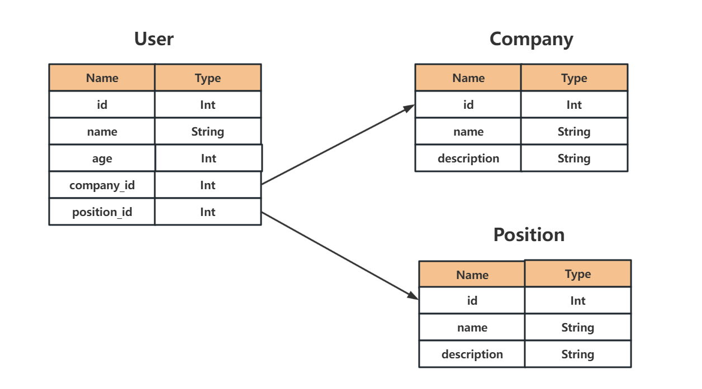
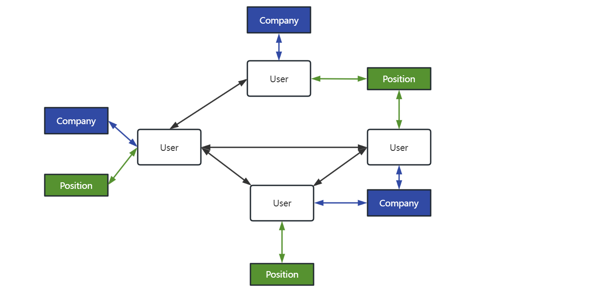

## Review of REST-ful Routing

```
Given a collection of records on a server
There should be a uniform url and HTTP request method used to utilize that collection of records
```

## HTTP Methods of Handling Posts

| URL | Method | Operation |
| --- | --- | --- |
| /users | POST | Create a new user |
| /users | GET | Fetch a list of all users |
| /users/23 | GET | Fetch details on user with ID 23 |
| /users/23 | PUT | Update details of user with ID 23 |
| /users/23 | DELETE | Delete user with ID 23 |

## The relationship of MySQL 



## Using a diagram to represent the structure of a database relationship



## Install Express & GraphQL packages

```
pnpm i -s express express-graphql graphql lodash
```

## How to build express

```
const express = require('express')
const app = express()
const port = 4000

app.get('/', (req, res) => {
    res.send('Hello world')
})

app.listen(port, () => {
    console.log(`Example app listening on port ${port}`)
})
```